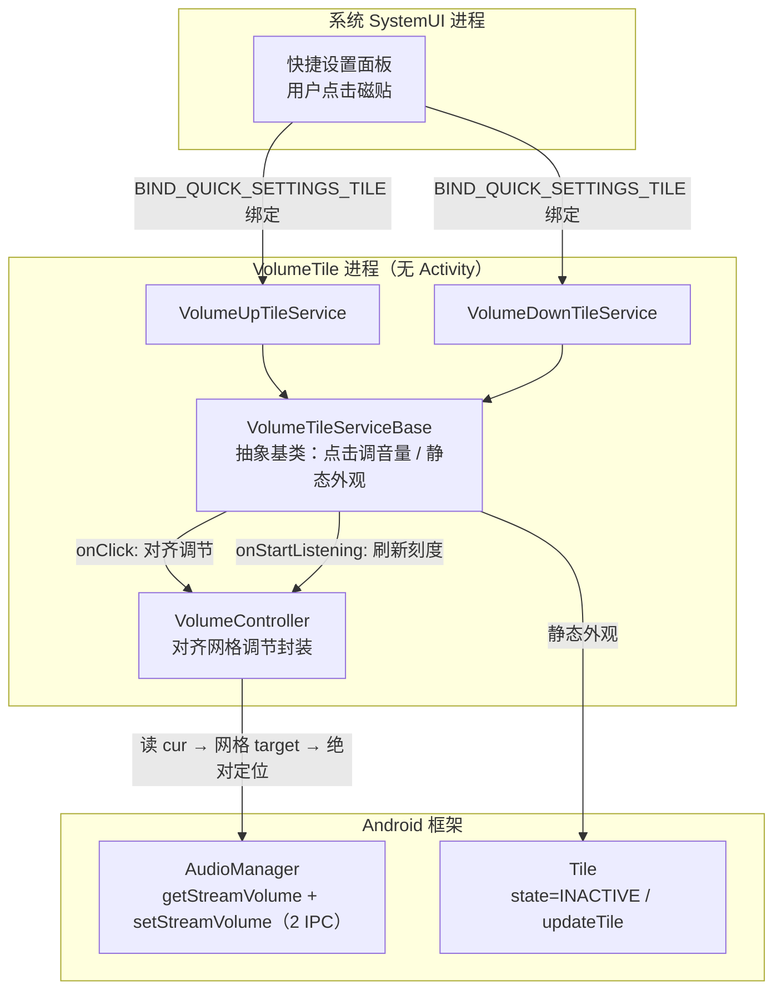
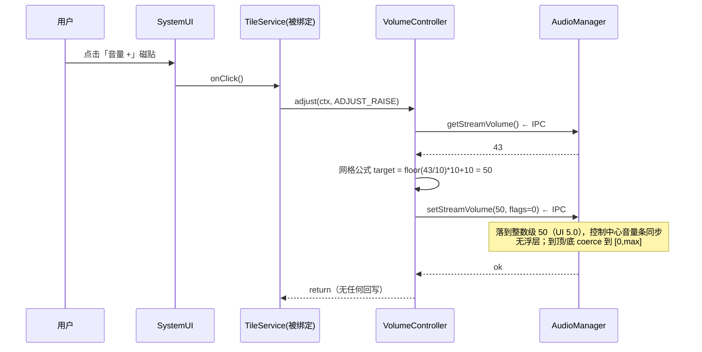

# VolumeTile 设计文档

> **文档版本**: v1.4（随实现滚动更新）
> **项目代号**: VolumeTile
> **目标平台**: Android 16（API 36），minSdk 34
> **文档状态**: 已实现并持续演进（v1.3：整数级对齐 + 纯静态无状态磁贴；v1.4：CI/文档维护轮，APK 行为与 1.3 一致）

---

## 1. 项目概述

### 1.1 一句话描述

VolumeTile 是一个**零界面（No-UI）**的 Android 工具应用：安装后不提供任何 Activity / 窗口，仅向系统下拉快捷设置面板提供**两个可固定的磁贴**，分别控制媒体音量**加一级 / 减一级**。

### 1.2 背景与动机

- 实体音量键位置不便或损坏时，需要一种不占用屏幕空间的替代调音量方式。
- 现有第三方音量 App 普遍携带完整 UI、广告或多余权限；本项目追求**最小实现**：无 UI、无运行时权限、无后台常驻、无第三方依赖。

### 1.3 目标（Goals）

| # | 目标 |
|---|---|
| G1 | 提供且仅提供两个快捷设置磁贴：音量 +1 级、音量 −1 级 |
| G2 | 应用全程无任何自有 UI（无 Activity、无悬浮窗、无通知） |
| G3 | 级数完全跟随系统实际值（15 级机型走 15 级，20 级机型走 20 级），到顶/到底自动停止 |
| G4 | 零运行时权限，安装即用 |
| G5 | 在不牺牲延迟的前提下选用公开 API：磁贴分类 36.1 照常使用；v1.2 弃用分组 API 改单 IPC 流接口；v1.3 对齐功能用 `getStreamVolume`+`setStreamVolume` 组合与小米官方 step 公式（`setSubtitle`/`stateDescription` 实测澎湃不可见后弃用） |
| G6 | （v1.3 修订 / D 方案）磁贴为纯静态工具：label 固定、无状态高亮；级数反馈由控制中心自带音量条承担（实测澎湃控制中心不渲染 subtitle） |

### 1.4 非目标（Non-Goals）

- ❌ 不控制铃声/闹钟/通话音量（固定控制**媒体音量**，见 §7.2）
- ❌ 不提供音量滑条、悬浮窗、桌面小部件等任何自有界面
- ❌ 不做开机自启、后台服务、网络访问
- ❌ 不支持 Android 14 以下设备（minSdk 34，见 §4.1）
- ❌ 不上架 Google Play（个人侧载分发）

---

## 2. 可行性结论摘要

前期调研结论（详见 [调研来源](#15-参考资料)）：

| 问题 | 结论 |
|---|---|
| 无 UI 应用是否合法？ | ✅ 合法，Manifest 不声明任何 `<activity>` 即可 |
| 磁贴用什么实现？ | ✅ `android.service.quicksettings.TileService`（API 24+，参考文档核实未弃用） |
| 调音量要权限吗？ | ✅ 媒体流范围内调节**不需要任何运行时权限**；`BIND_QUICK_SETTINGS_TILE` 为系统绑定声明，系统自动授予 |
| Android 16（targetSdk 36）行为变更是否影响？ | ✅ 已逐条核对 [针对 targetSdk 36](https://developer.android.com/about/versions/16/behavior-changes-16) 与 [针对所有应用](https://developer.android.com/about/versions/16/behavior-changes-all) 两份清单，无任何音量/音频/磁贴相关条目 |
| Android 17 "后台音频强化"是否影响？ | ✅ 不影响：该变更限制后台擅自播放/停止音频，不涉及音量调节，且磁贴点击属用户主动交互 |

---

## 3. 总体架构

### 3.1 架构图



### 3.2 组件清单

| 组件 | 类型 | 职责 |
|---|---|---|
| `VolumeTileServiceBase` | `abstract class : TileService` | 磁贴生命周期：`onClick` 仅调音量（对齐网格定位）、`onStartListening` 刷新刻度缓存 + 无条件确保 `STATE_INACTIVE` 静态外观 |
| `VolumeUpTileService` | `class : VolumeTileServiceBase` | 音量 +1 磁贴入口，仅声明方向常量 |
| `VolumeDownTileService` | `class : VolumeTileServiceBase` | 音量 −1 磁贴入口，仅声明方向常量 |
| `VolumeController` | `object`（纯逻辑，无 Android UI 依赖） | 封装对齐网格调节（step = max/15）与原生 adjust 回退 |

**依赖关系**：`TileService 子类 → VolumeController`；无其他模块、无第三方库。

---

## 4. 构建与技术选型

### 4.1 SDK 与语言

| 配置 | 值 | 理由 |
|---|---|---|
| 语言 | Kotlin（纯代码，无 View/Compose） | 样板最少 |
| `minSdk` | **34**（Android 14） | 个人唯一设备为 Android 16；v1.3 对齐仅依赖 API 1 级接口（`setStreamVolume`），34 作为统一基线（`setSubtitle`/`stateDescription` 实测不可用后已非理由），无需任何版本分支判断 |
| `targetSdk` | **36**（Android 16） | 当前最新正式版；行为变更清单已核实无影响 |
| `compileSdk` | 36 | 与 target 对齐，可用 36.1 的 `TILE_CATEGORY` 常量（运行期由旧系统忽略） |
| 第三方依赖 | **零** | 框架 API 全覆盖；APK 预期 < 200 KB |

### 4.2 Gradle 配置（`app/build.gradle.kts` 关键片段）

```kotlin
android {
    namespace = "com.tedexcuseme.volumetile"
    compileSdk = 36

    defaultConfig {
        applicationId = "com.tedexcuseme.volumetile"
        minSdk = 34
        targetSdk = 36
        versionCode = 5
        versionName = "1.4"
    }
}
```

> 完整文件另含 `buildTypes`（release 不配签名，见 §5 与 CI）与 `compileOptions`/`kotlin` JVM 17 对齐；无任何 `dependencies`。

### 4.3 分发方式（CI-only）

- 仓库**不携带 Gradle wrapper**、不要求本地 Android 环境：全部构建在 GitHub Actions 完成。
- push 到 `release/**` 分支（或手动触发）→ CI 产出**已签名 APK** → 从该次 run 的 Artifacts 或 `continuous` 滚动预发布下载安装（步骤见 README）。
- 签名链路：Gradle 产出 unsigned APK → CI 用 `apksigner --ks-type PKCS12` 显式签名（密钥 `keystore/release.p12` 随仓库提交）。
- 纯文档变更（`docs/**`、`*.md`）经 `paths-ignore` 不触发构建。

---

## 5. AndroidManifest 设计

```xml
<?xml version="1.0" encoding="utf-8"?>
<manifest xmlns:android="http://schemas.android.com/apk/res/android">

    <!-- normal 级权限，安装即授予，无弹窗；调音量惯例声明 -->
    <uses-permission android:name="android.permission.MODIFY_AUDIO_SETTINGS" />

    <application
        android:label="@string/app_name"
        android:icon="@mipmap/ic_launcher"
        android:allowBackup="false"
        android:supportsRtl="true">

        <!-- 音量 +1 磁贴 -->
        <service
            android:name=".tile.VolumeUpTileService"
            android:label="@string/tile_up_label"
            android:icon="@drawable/ic_volume_up"
            android:permission="android.permission.BIND_QUICK_SETTINGS_TILE"
            android:exported="true">
            <intent-filter>
                <action android:name="android.service.quicksettings.action.QS_TILE" />
            </intent-filter>
            <!-- 磁贴定义（label + icon），旧系统的唯一来源 -->
            <meta-data
                android:name="android.service.quicksettings.TILE"
                android:resource="@xml/tile_volume_up" />
            <!-- API 36.1 新增：磁贴编辑页分类；旧系统自动忽略该 meta-data -->
            <meta-data
                android:name="android.service.quicksettings.TILE_CATEGORY"
                android:value="android.service.quicksettings.CATEGORY_DISPLAY" />
        </service>

        <!-- 音量 −1 磁贴：结构同上，指向 tile_volume_down / ic_volume_down -->
        <service
            android:name=".tile.VolumeDownTileService"
            ... />
    </application>
</manifest>
```

### 5.1 Manifest 要点说明

| 设计点 | 决策 | 理由 |
|---|---|---|
| 无 `<activity>` | 不声明任何 Activity | G2；应用不出现在桌面启动器，仅出现在「设置 → 应用」与磁贴编辑页 |
| `android:permission="BIND_QUICK_SETTINGS_TILE"` | 必须 | 限定仅系统（SystemUI）可绑定该服务 |
| `exported="true"` | 必须 | 配合 intent-filter 供系统发现 |
| intent-filter action = `android.service.quicksettings.action.QS_TILE` | **必须精确等于此值**（`TileService.ACTION_BIND_QS_TILE` 常量） | ⚠️ 实测教训：曾误写为 `android.service.quicksettings.TileService`（貌似合理但不存在），SystemUI 按该 action 查询 PackageManager 永远查不到 → 磁贴不出现且重启无效。小米《MIUI10通知栏快捷开关适配说明》官方示例同此值 |
| `TILE_CATEGORY` = `CATEGORY_DISPLAY` | 可选但推荐（36.1 官方 recommended） | 把磁贴归入 Android 16 QPR1+ 编辑页的「显示」类；纯分类美观项，改 `CATEGORY_UTILITIES` 亦可 |
| 不声明 `ACTIVE_TILE` | **刻意不使用主动磁贴模式** | 被动磁贴在每次面板展开时绑定刷新，磁贴级数显示永远最新（包括用户用实体键调过的情况）；主动磁贴仅在点击时绑定，省电但显示可能过期——本项目显示新鲜度优先，见 §7.1 |
| 不声明 `TOGGLEABLE_TILE` | 不使用 | 语义是"开关型磁贴"的无障碍 Switch 行为；音量 ±1 不是开/关状态 |
| `MODIFY_AUDIO_SETTINGS` | 声明 | normal 级、安装即得；虽媒体流调节实际不强制，作为惯例声明防御性保留 |
| `allowBackup="false"` | 关闭 | 无任何持久化数据，无可备份内容 |

---

## 6. 核心类设计

### 6.1 `VolumeTileServiceBase`（抽象基类）

```kotlin
package com.tedexcuseme.volumetile.tile

abstract class VolumeTileServiceBase : TileService() {

    /** 子类声明方向：AudioManager.ADJUST_RAISE / ADJUST_LOWER */
    protected abstract val direction: Int

    /** 点击磁贴：唯一工作就是调音量（对齐网格定位），绝不被任何回写延迟 */
    override fun onClick() {
        VolumeController.adjust(applicationContext, direction)
    }

    /** 面板展开/磁贴可见：刷新刻度缓存 + 确保静态（未高亮）外观；兼作 Binder 预热 */
    override fun onStartListening() {
        VolumeController.refreshScale(applicationContext)
        qsTile?.let {
            it.state = Tile.STATE_INACTIVE   // 无条件写（防 SystemUI 侧重建后的 UNAVAILABLE 缺省态）
            it.updateTile()
        }
    }
}
```

**职责边界（v1.3 静态化）**：基类只做两件事——点击调音量、监听时保证静态外观与刻度缓存。**v1.0–1.2 的整套动态回写机制已全部删除**（subtitle/stateDescription 更新、250ms 节流、Handler/post、lastLevel 比对、onDestroy 回调清理）：D 方案下 label 永不改写、级数不显示，回写的唯一剩余作用是把状态写成 `STATE_INACTIVE`（未高亮的中性工具外观）。**收益**：每击省 2–3 次 IPC、每面板打开省 2 次读 IPC、消除全部 SystemUI 磁贴视图重绘（E4 的彻底版——连点风暴期 SystemUI 不再因我方回写进入状态刷新）。**状态写必须无条件执行**：本地 `Tile` 对象无法感知 SystemUI 侧的磁贴重建，缺省态若为 `UNAVAILABLE`，`CustomTile.handleClick` 会在 SystemUI 侧直接丢弃点击（AOSP 源码已核实），磁贴会"失灵"。

### 6.2 磁贴子类

```kotlin
class VolumeUpTileService : VolumeTileServiceBase() {
    override val direction = AudioManager.ADJUST_RAISE
}
class VolumeDownTileService : VolumeTileServiceBase() {
    override val direction = AudioManager.ADJUST_LOWER
}
```

### 6.3 `VolumeController`（音量核心）

**对齐网格设计（v1.3 / K1 实测确认）**：HyperOS 无极音量把媒体刻度扩展为 0..150（K1 实测 `max = 150`），系统滑条可停在任意整数位（如 43）。v1.2 直接 `adjust` 会保留该偏移（43 → 33），与"磁贴调节必须落到整数级"的产品语义不符。v1.3 起改为**读 cur → 网格公式 → `setStreamVolume` 绝对定位**（每击 2 次 IPC）：步长采用小米《MIUI无极音量适配说明》官方公式 `step = max / 15`（= 10），`max % 15 ≠ 0` 的机型自动回退原生 `adjustStreamVolume`；`step = 1` 时网格公式与原生 adjust 恒等，普通安卓机型零回归。

```kotlin
package com.tedexcuseme.volumetile.volume

object VolumeController {

    private const val FLAGS = 0   // 静默调节：不请求系统音量浮层，见 §7.2 反馈策略

    private var cachedAudioManager: AudioManager? = null

    /** 刻度缓存：面板每次可见时由 refreshScale 刷新（非点击路径，1 IPC） */
    private var cachedMax = 0
    private var cachedStep = 0   // 0 = 网格不可用 → 回退原生 adjust

    fun refreshScale(context: Context) {
        runCatching {
            val max = audioManager(context).getStreamMaxVolume(AudioManager.STREAM_MUSIC)
            cachedMax = max
            cachedStep = if (max > 0 && max % 15 == 0) max / 15 else 0
        }
    }

    /** 调节媒体音量一级并对齐到整数级网格。任何异常都不会抛给调用方。 */
    fun adjust(context: Context, direction: Int) {
        val am = runCatching { audioManager(context) }.getOrNull() ?: return
        if (cachedStep <= 0) refreshScale(context)   // 懒初始化 / 运行时重试
        val step = cachedStep
        if (step <= 0) {
            runCatching { am.adjustStreamVolume(AudioManager.STREAM_MUSIC, direction, FLAGS) }
            return
        }
        runCatching {
            val cur = am.getStreamVolume(AudioManager.STREAM_MUSIC)
            val target = (if (direction == AudioManager.ADJUST_RAISE) {
                cur / step * step + step              // 升：floor 到网格再走一级
            } else {
                (cur + step - 1) / step * step - step  // 降：ceil 到网格再退一级
            }).coerceIn(0, cachedMax)
            am.setStreamVolume(AudioManager.STREAM_MUSIC, target, FLAGS)
        }
    }

    private fun audioManager(context: Context): AudioManager =
        cachedAudioManager
            ?: context.getSystemService(AudioManager::class.java)!!
                .also { cachedAudioManager = it }
}
```

**设计要点**：

1. **网格公式与数据校验**：升 `floor(cur/step)×step+step`、降 `ceil(cur/step)×step−step`（整数运算）；K1 实测数据全部通过——`45+ → 50`、`45− → 40`、`43− → 40`、`40± → 50/30`、顶/底 `coerceIn(0,max)` 不越界。
2. **step 公式官方背书**：`step = max / 15`（小米《MIUI无极音量适配说明》），与系统自身 adjust 步长同格（15 次触顶实测一致）；`max % 15 != 0` → `step = 0` → 回退原生 adjust（网格无定义的机型保持原行为）。
3. **绝对定位清分数**：`setStreamVolume` 直接写目标整数，滑条造成的偏移（如 43）被一次性吸附，无需"读取分数"的隐藏 API。
4. **IPC 构成**：点击路径 = 读 cur（1）+ set（1）= 2 次；`max`/`step` 只在面板可见时经 `refreshScale` 刷新（每面板打开 1 次，不在点击路径）。
5. **绝不外抛 / 静默**：全程 `runCatching`，`flags = 0`；媒体流不触发 DND 异常。
6. **不使用 `adjustSuggestedStreamVolume(USE_DEFAULT_STREAM_TYPE)`**：跟随实体键"当前流"引入 DND 与铃声模式变量，固定媒体流行为可预期。

### 6.4 点击时序



---

## 7. 交互与反馈设计

### 7.1 磁贴模式选择：被动（Passive）磁贴

| 特性 | 被动磁贴（**本项目采用**） | 主动磁贴 `ACTIVE_TILE` |
|---|---|---|
| 绑定时机 | 面板展开且磁贴可见时 | 仅点击时（状态由 App 自维护） |
| 状态/刻度刷新 | ✅ 每次面板可见时刷新（刻度缓存 + 静态外观） | ⚠️ 仅在 App 进程存活并 `requestListeningState` 后刷新 |
| 复杂度 | 低（默认行为） | 需进程管理与推送逻辑 |
| 成本 | 面板展开时一次轻量绑定（仅当磁贴在面板上） | 更省电 |

本项目采用被动模式且**不**声明 `ACTIVE_TILE`：面板展开即绑定——这既是**进程预热（gkd 式唤醒、首击零等待）的来源**，也让刻度缓存每次可见时得到刷新；v1.3 虽已不显示级数，预热价值仍是选择被动模式的主因。

### 7.2 音量反馈策略：静默调节（flags = 0）+ 静态磁贴（D 方案）

| 方案 | flags | 效果 | 决策 |
|---|---|---|---|
| 静默调节 | `0` | 无任何浮层；反馈 = 控制中心自带音量条实时同步 | ✅ **v1.1 起采用**——澎湃控制中心本身提供音量条，无需额外弹窗；同时作为高频点击修复实验 **E1**（排除系统浮层干扰连点） |
| 系统音量面板 | `FLAG_SHOW_UI` | 弹出系统音量条浮层 | 备选（v1.0 曾采用）；若验证 CD 另有原因可一行切回 |
| 声音/振动反馈 | `+ FLAG_PLAY_SOUND / FLAG_VIBRATE` | 每级有提示音/振动 | 暂不采用（避免双重反馈） |

**D 方案（v1.3）+ 无状态外观**：磁贴 label 保持静态（`音量 +` / `音量 -`），**不显示级数**——实测澎湃控制中心不渲染 `subtitle`（原生 Android 渲染），级数反馈统一由控制中心自带音量条承担。磁贴状态固定写为 `STATE_INACTIVE`（未高亮的中性工具外观），不表达"开/关"语义（系统仅有 ACTIVE/INACTIVE/UNAVAILABLE 三态，无"无状态"档位）。由此 **v1.0–1.2 的整套回写/节流机制（E4）整体删除**，见 §6.1。

**级别步进（v1.3 对齐）**：步进由网格公式实现——`step = max / 15`（HyperOS = 10，普通机型 = 1），天然满足 G3（15 级机型 15 级，随系统实际 max 自动适配）；到顶/到底 `coerceIn(0, max)`，不循环、不越界。

### 7.3 锁屏行为

- 调节媒体音量**不属于敏感操作**，直接执行，不调用 `unlockAndRun()` / `showDialog()`。
- `TileService` 在锁屏下由 SystemUI 按系统策略绑定；`onClick` 内不弹任何界面，无安全提示需求。

### 7.4 界面占位与冲突

- v1.1 起为静默模式（flags = 0），不产生任何浮层窗口，与 G2（零自有 UI）的关系更干净。
- 面板展开状态下点击磁贴：磁贴侧无任何回写；级数反馈完全由控制中心自带音量条承担。

---

## 8. 资源与本地化设计

### 8.1 字符串资源（`res/values/strings.xml`，中文为默认）

```xml
<resources>
    <string name="app_name">音量磁贴</string>
    <string name="tile_up_label">音量 +</string>
    <string name="tile_down_label">音量 -</string>
    <!-- v1.3（D 方案）：不显示级数，tile_level_fmt 已删除 -->
</resources>
```

英文资源 `values-en/strings.xml` 可选（个人项目可后补）。

### 8.2 磁贴显示规则

| 元素 | 内容 | 来源 |
|---|---|---|
| 主标签（label） | `音量 +` / `音量 -` | 磁贴 XML / service label，运行时永不改写（D 方案） |
| 状态 | `STATE_INACTIVE`（未高亮的中性外观） | 每次 `onStartListening` 无条件写入（v1.3） |
| 图标 | 见 §8.3 | 矢量资源 |

> v1.3 实测结论：澎湃控制中心**不渲染 subtitle**（原生 Android 渲染），故 D 方案下级数不显示、label 不改写；级数反馈由控制中心自带音量条承担。

### 8.3 图标设计

- `drawable/ic_volume_up.xml`、`ic_volume_down.xml`：Material Design 官方 `volume_up` / `volume_down` 路径的矢量图（Apache-2.0 许可，与仓库 LICENSE 兼容），纯白填充，24dp viewBox。
- 磁贴图标由系统按主题着色/适配，无需自定义颜色。
- 应用图标：最小化处理——任意简单矢量占位即可（应用无启动器入口，图标仅在设置页显示）。

### 8.4 磁贴 XML（`res/xml/tile_volume_up.xml`）

```xml
<?xml version="1.0" encoding="utf-8"?>
<tile xmlns:android="http://schemas.android.com/apk/res/android"
    android:label="@string/tile_up_label"
    android:icon="@drawable/ic_volume_up" />
```

> service 节点与磁贴 XML 同时携带 label/icon：XML 为旧系统来源，service 属性为新系统来源，保持一致避免显示差异。

---

## 9. 边界情况与错误处理

| # | 场景 | 预期行为 | 实现手段 |
|---|---|---|---|
| E1 | 音量已在最大/最小 | 网格目标经 `coerceIn(0, max)`，停在边界，不循环、不报错 | §6.3 绝对定位 + 边界钳制 |
| E2 | 系统总级数 ≠ 15（如 20 级、7 级） | 步进按实际值（step = max/15，%15≠0 回退原生） | 只读 `getStreamMaxVolume`，硬编码零处 |
| E3 | 勿扰模式（DND）下触发 `SecurityException` | 本次点击静默失败，磁贴不崩溃、不卡死 | `runCatching` 兜底（§6.3）；媒体流实际不触发 |
| E4 | SystemUI 侧重建磁贴（我方进程未重启） | 无条件写 `STATE_INACTIVE` 保证可点击且未高亮，避免缺省态 `UNAVAILABLE` 导致点击被 SystemUI 丢弃 | §6.1 无条件写策略 |
| E5 | 设备为固定音量设备（`isVolumeFixed`，车机/演示机） | 调节无效但不崩溃 | API 空操作 + `runCatching`；手机端不会出现 |
| E6 | 磁贴进程被系统回收后面板展开 | SystemUI 重新拉起服务，`onStartListening` 照常执行（刷新刻度缓存 + 确保静态状态） | 被动磁贴标准行为，无需处理 |
| E7 | 锁屏下点击 | 正常调节，不解锁、不弹窗 | §7.3 |
| E8 | 用户用实体键/其他 App 改了音量 | 行为不受影响（磁贴无显示状态依赖）；音量条自然反映真实值 | v1.3 已移除全部显示回写 |
| E9 | 连续快速点击 | 每次点击独立生效，级数单调到界为止 | 无状态累积逻辑 |
| E10 | 旧系统（< 36.1）遇到 `TILE_CATEGORY` | 忽略未知 meta-data，磁贴正常 | 平台标准行为 |

---

## 10. 兼容性说明

### 10.1 API 使用矩阵

| API | 级别 | 用途 | minSdk 34 下可用性 |
|---|---|---|---|
| `TileService` 全套（`onClick`/`onStartListening`/`qsTile`） | 24 | 磁贴骨架 | ✅ |
| `Tile.setSubtitle` / `Tile.setStateDescription` | 29 / 30 | 曾用于级数副标题/播报 | ❌ v1.3 弃用：实测澎湃不渲染 subtitle（D 方案） |
| `adjustVolumeGroupVolume` 等分组 API | 34 | 曾为 v1.0–1.1 主路径 | ❌ v1.2 弃用：手机上行为终点即流接口，却多一次串行 IPC（§6.3 延迟审查 R1） |
| `setStreamVolume` | 1 | **v1.3 对齐定位（核心）**：写网格目标、清分数 | ✅ |
| `getStreamVolume` / `getStreamMaxVolume` | 1 | 对齐读数 + 刻度（step = max/15，面板可见时缓存） | ✅ |
| `adjustStreamVolume` | 1 | 网格回退路径（max%15≠0 机型 / 刻度初始化失败） | ✅（未弃用，参考文档核实） |
| `TILE_CATEGORY` 分类元数据 | 36.1 | 磁贴编辑页归类 | ✅ 旧系统忽略 |
| `STREAM_ASSISTANT` 等 Android 17 API | 37 | — | ❌ 不使用（设备为 Android 16） |

### 10.2 系统版本影响面

- **Android 14–16**：设计覆盖范围内（minSdk 34）。
- **Android 16 行为变更**：已逐条核对两份官方清单，无音量/音频/磁贴条目；本应用无 Activity，"无边框""预测性返回"等条目不适用。
- **Android 17 前瞻**："后台音频强化"仅约束后台擅自播放/停止音频，不涉及调音量；无需提前适配。
- **OEM 差异（MIUI/ColorOS 等）**：磁贴由 SystemUI 绑定，不受杀后台策略影响；澎湃特有行为（不渲染 subtitle → D 方案、无极音量 0..150 刻度 → step = max/15）均已在实现中适配，其余厂商按 AOSP 标准路径工作（已知例外：vivo OriginOS 有三方磁贴异常的公开 issue，待真机验证）。

---

## 11. 无障碍设计

| 措施 | 说明 |
|---|---|
| 不写 `stateDescription`（v1.3） | 级数不显示（D 方案），TalkBack 播报静态 label |
| `Tile` 主标签为可读文本 | 非纯图标磁贴 |
| 不设置 `TOGGLEABLE_TILE` | 避免被无障碍框架当作 Switch 开关误播"开/关"状态 |
| 静默 + 静态磁贴 | 无浮层；控制中心自带音量条由系统提供无障碍支持 |

---

## 12. 测试计划

### 12.1 手工验收用例

| # | 步骤 | 预期 |
|---|---|---|
| T1 | 安装 APK，下拉面板 → 编辑 → 添加两个磁贴 | 两个磁贴出现在编辑列表，标签/图标正确；Android 16 QPR1+ 归入「显示」类 |
| T2 | 点击「音量 +」×3 | 媒体音量 +3 级（网格步进）；控制中心自带音量条同步变化，无额外弹窗；磁贴 label 恒为「音量 +」 |
| T3 | 点击「音量 −」至 0 | 停在 0，不循环、无崩溃 |
| T4 | 持续「音量 +」到最大 | 停在 max（coerceIn），不越界；磁贴无状态变化（恒未高亮） |
| T5 | 用实体音量键/滑条改音量后，再次下拉面板 | 磁贴外观不变（静态）；控制中心音量条反映真实值 |
| T6 | 锁屏状态下点击磁贴 | 音量正常变化，无需解锁，无弹窗 |
| T7 | 开启勿扰模式后点击 | 不崩溃（若被策略拒绝则静默无变化） |
| T8 | 开启 TalkBack 点击磁贴 | 播报静态标签「音量 +」/「音量 -」 |
| T9 | 清除应用/重启手机后（磁贴仍固定） | 点击立即生效，无需先打开任何界面 |
| T10 | 级数非 15 的机型（若有） | step = max/15；max%15≠0 时回退原生步进 |
| T11 | 滑条调到非整数级（如 UI 4.3 / API 43）后点「音量 −」或「音量 +」 | 结果落到整数级 40 / 50（UI 4 / 5），而非 33 / 53 |

### 12.2 构建验收

- [ ] CI `gradle assembleRelease` 构建通过（GitHub Actions 绿色）
- [ ] APK 依赖清单仅含 framework（无第三方库）
- [ ] Manifest 要素核对：QS_TILE action / BIND 权限 / exported 齐全（见 §5.1）
- [ ] 应用出现在「设置 → 应用」，**不**出现在桌面启动器

---

## 13. 目录结构规划

```
VolumeTile/
├── docs/
│   └── design.md                ← 本文档
├── app/
│   ├── build.gradle.kts
│   └── src/main/
│       ├── AndroidManifest.xml
│       ├── java/com/tedexcuseme/volumetile/
│       │   ├── volume/VolumeController.kt
│       │   └── tile/
│       │       ├── VolumeTileServiceBase.kt
│       │       ├── VolumeUpTileService.kt
│       │       └── VolumeDownTileService.kt
│       └── res/
│           ├── drawable/ic_volume_up.xml
│           ├── drawable/ic_volume_down.xml
│           ├── mipmap-anydpi-v26/ic_launcher.xml
│           ├── values/strings.xml
│           └── xml/
│               ├── tile_volume_up.xml
│               └── tile_volume_down.xml
├── build.gradle.kts
├── settings.gradle.kts
├── gradle.properties
└── LICENSE
```

---

## 14. 未来扩展（当前范围外）

| 扩展 | 思路 | 触发条件 |
|---|---|---|
| 铃声/闹钟音量磁贴 | 复用基类，参数化 stream / `AudioAttributes` | 实际需求出现 |
| 静音开关磁贴 | `Tile.STATE_INACTIVE` + `adjustStreamVolume(ADJUST_MUTE)` | 需求 |
| 反馈模式切换（静默 ↔ 系统音量条浮层） | 当前固定 `flags = 0`（v1.1 起静默）；若需可切换须引入本地开关 → 设置页与 G2 冲突，需重新评估 | 用户反馈想要 `FLAG_SHOW_UI` 浮层时 |
| 主动磁贴模式 | 声明 `ACTIVE_TILE` + `requestListeningState` | 磁贴数量/耗电优化需求 |
| 多语言 | 补 `values-en/strings.xml` | 分享给他人时 |

---

## 15. 参考资料

- [创建自定义快捷设置磁贴（官方指南）](https://developer.android.com/develop/ui/views/quicksettings-tiles)
- [`TileService` API 参考](https://developer.android.com/reference/android/service/quicksettings/TileService)
- [`Tile` API 参考](https://developer.android.com/reference/android/service/quicksettings/Tile)
- [`AudioManager` API 参考](https://developer.android.com/reference/android/media/AudioManager)
- [API 29 差异：`Tile.setSubtitle` 新增](https://developer.android.google.cn/sdk/api_diff/29/changes/android.service.quicksettings.Tile)
- [AOSP：快捷设置磁贴分类机制](https://source.android.google.cn/docs/core/display/quick-settings-tile)
- [Android 16 行为变更（targetSdk 36）](https://developer.android.com/about/versions/16/behavior-changes-16)
- [Android 16 行为变更（所有应用）](https://developer.android.com/about/versions/16/behavior-changes-all)
- [Android 15 新版音量面板（外部报道）](https://www.androidpolice.com/android-15-beta-2-redesigned-volume-panel/)
- [AOSP：车载音频音量分组管理（分组 API 出处）](https://source.android.google.cn/docs/automotive/audio/volume-management)
