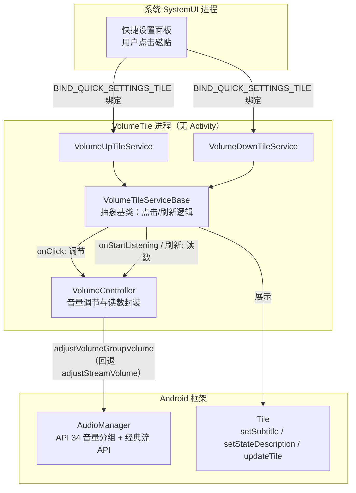
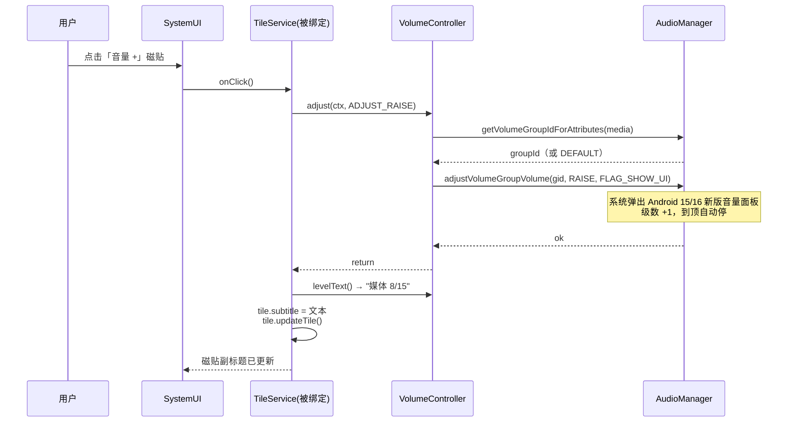

# VolumeTile 设计文档

> **文档版本**: v1.0（草稿）
> **项目代号**: VolumeTile
> **目标平台**: Android 16（API 36），minSdk 34
> **文档状态**: 待实现前评审

---

## 1. 项目概述

### 1.1 一句话描述

VolumeTile 是一个**零界面（No-UI）**的 Android 工具应用：安装后不提供任何 Activity / 窗口，仅向系统下拉快捷设置面板提供**两个可固定的磁贴**，分别控制媒体音量**加一级 / 减一级**。

### 1.2 背景与动机

- 实体音量键位置不便或损坏时，需要一种不占用屏幕空间的替代调音量方式。
- 现有第三方音量 App 普遍携带完整 UI、广告或多余权限；本项目追求**最小实现**：无 UI、无运行时权限、无后台常驻、无第三方依赖。

### 1.3 目标（Goals）

| # | 目标 |
|---|---|
| G1 | 提供且仅提供两个快捷设置磁贴：音量 +1 级、音量 −1 级 |
| G2 | 应用全程无任何自有 UI（无 Activity、无悬浮窗、无通知） |
| G3 | 级数完全跟随系统实际值（15 级机型走 15 级，20 级机型走 20 级），到顶/到底自动停止 |
| G4 | 零运行时权限，安装即用 |
| G5 | 使用尽可能新的公开 API（音量分组 API 34、磁贴分类 API 36.1 等），同时保留经典 API 兜底 |
| G6 | 磁贴文字实时反映当前音量（如 `媒体 7/15`） |

### 1.4 非目标（Non-Goals）

- ❌ 不控制铃声/闹钟/通话音量（固定控制**媒体音量**，见 §7.2）
- ❌ 不提供音量滑条、悬浮窗、桌面小部件等任何自有界面
- ❌ 不做开机自启、后台服务、网络访问
- ❌ 不支持 Android 14 以下设备（minSdk 34，见 §4.1）
- ❌ 不上架 Google Play（个人侧载分发）

---

## 2. 可行性结论摘要

前期调研结论（详见 [调研来源](#15-参考资料)）：

| 问题 | 结论 |
|---|---|
| 无 UI 应用是否合法？ | ✅ 合法，Manifest 不声明任何 `<activity>` 即可 |
| 磁贴用什么实现？ | ✅ `android.service.quicksettings.TileService`（API 24+，参考文档核实未弃用） |
| 调音量要权限吗？ | ✅ 媒体流范围内调节**不需要任何运行时权限**；`BIND_QUICK_SETTINGS_TILE` 为系统绑定声明，系统自动授予 |
| Android 16（targetSdk 36）行为变更是否影响？ | ✅ 已逐条核对 [针对 targetSdk 36](https://developer.android.com/about/versions/16/behavior-changes-16) 与 [针对所有应用](https://developer.android.com/about/versions/16/behavior-changes-all) 两份清单，无任何音量/音频/磁贴相关条目 |
| Android 17 "后台音频强化"是否影响？ | ✅ 不影响：该变更限制后台擅自播放/停止音频，不涉及音量调节，且磁贴点击属用户主动交互 |

---

## 3. 总体架构

### 3.1 架构图



### 3.2 组件清单

| 组件 | 类型 | 职责 |
|---|---|---|
| `VolumeTileServiceBase` | `abstract class : TileService` | 磁贴生命周期处理：`onClick` 调节音量、`onStartListening`/`refreshTile` 刷新显示 |
| `VolumeUpTileService` | `class : VolumeTileServiceBase` | 音量 +1 磁贴入口，仅声明方向常量 |
| `VolumeDownTileService` | `class : VolumeTileServiceBase` | 音量 −1 磁贴入口，仅声明方向常量 |
| `VolumeController` | `object`（纯逻辑，无 Android UI 依赖） | 封装音量调节（新 API + 回退）、当前级数读取 |

**依赖关系**：`TileService 子类 → VolumeController`；无其他模块、无第三方库。

---

## 4. 构建与技术选型

### 4.1 SDK 与语言

| 配置 | 值 | 理由 |
|---|---|---|
| 语言 | Kotlin（纯代码，无 View/Compose） | 样板最少 |
| `minSdk` | **34**（Android 14） | 个人唯一设备为 Android 16；34 解锁音量分组 API（34）、`setSubtitle`（29）、`stateDescription`（30），无需任何版本分支判断 |
| `targetSdk` | **36**（Android 16） | 当前最新正式版；行为变更清单已核实无影响 |
| `compileSdk` | 36 | 与 target 对齐，可用 36.1 的 `TILE_CATEGORY` 常量（运行期由旧系统忽略） |
| 第三方依赖 | **零** | 框架 API 全覆盖；APK 预期 < 200 KB |

### 4.2 Gradle 配置（`app/build.gradle.kts` 关键片段）

```kotlin
android {
    namespace = "dev.volumetile"
    compileSdk = 36

    defaultConfig {
        applicationId = "dev.volumetile"
        minSdk = 34
        targetSdk = 36
        versionCode = 1
        versionName = "1.0"
    }

    buildFeatures { buildConfig = false }
    // 无 viewBinding / compose —— 没有界面
}

dependencies {
    // 刻意为空：仅依赖 android.jar 框架 API
}
```

### 4.3 分发方式

- `./gradlew assembleDebug` 产出 APK → `adb install` 或直接手机安装。
- 无签名要求（自用）；如需统一签名，使用本地 debug/自生成 keystore。

---

## 5. AndroidManifest 设计

```xml
<?xml version="1.0" encoding="utf-8"?>
<manifest xmlns:android="http://schemas.android.com/apk/res/android">

    <!-- normal 级权限，安装即授予，无弹窗；调音量惯例声明 -->
    <uses-permission android:name="android.permission.MODIFY_AUDIO_SETTINGS" />

    <application
        android:label="@string/app_name"
        android:icon="@mipmap/ic_launcher"
        android:allowBackup="false"
        android:supportsRtl="true">

        <!-- 音量 +1 磁贴 -->
        <service
            android:name=".tile.VolumeUpTileService"
            android:label="@string/tile_up_label"
            android:icon="@drawable/ic_volume_up"
            android:permission="android.permission.BIND_QUICK_SETTINGS_TILE"
            android:exported="true">
            <intent-filter>
                <action android:name="android.service.quicksettings.action.QS_TILE" />
            </intent-filter>
            <!-- 磁贴定义（label + icon），旧系统的唯一来源 -->
            <meta-data
                android:name="android.service.quicksettings.TILE"
                android:resource="@xml/tile_volume_up" />
            <!-- API 36.1 新增：磁贴编辑页分类；旧系统自动忽略该 meta-data -->
            <meta-data
                android:name="android.service.quicksettings.TILE_CATEGORY"
                android:value="android.service.quicksettings.CATEGORY_DISPLAY" />
        </service>

        <!-- 音量 −1 磁贴：结构同上，指向 tile_volume_down / ic_volume_down -->
        <service
            android:name=".tile.VolumeDownTileService"
            ... />
    </application>
</manifest>
```

### 5.1 Manifest 要点说明

| 设计点 | 决策 | 理由 |
|---|---|---|
| 无 `<activity>` | 不声明任何 Activity | G2；应用不出现在桌面启动器，仅出现在「设置 → 应用」与磁贴编辑页 |
| `android:permission="BIND_QUICK_SETTINGS_TILE"` | 必须 | 限定仅系统（SystemUI）可绑定该服务 |
| `exported="true"` | 必须 | 配合 intent-filter 供系统发现 |
| intent-filter action = `android.service.quicksettings.action.QS_TILE` | **必须精确等于此值**（`TileService.ACTION_BIND_QS_TILE` 常量） | ⚠️ 实测教训：曾误写为 `android.service.quicksettings.TileService`（貌似合理但不存在），SystemUI 按该 action 查询 PackageManager 永远查不到 → 磁贴不出现且重启无效。小米《MIUI10通知栏快捷开关适配说明》官方示例同此值 |
| `TILE_CATEGORY` = `CATEGORY_DISPLAY` | 可选但推荐（36.1 官方 recommended） | 把磁贴归入 Android 16 QPR1+ 编辑页的「显示」类；纯分类美观项，改 `CATEGORY_UTILITIES` 亦可 |
| 不声明 `ACTIVE_TILE` | **刻意不使用主动磁贴模式** | 被动磁贴在每次面板展开时绑定刷新，磁贴级数显示永远最新（包括用户用实体键调过的情况）；主动磁贴仅在点击时绑定，省电但显示可能过期——本项目显示新鲜度优先，见 §7.1 |
| 不声明 `TOGGLEABLE_TILE` | 不使用 | 语义是"开关型磁贴"的无障碍 Switch 行为；音量 ±1 不是开/关状态 |
| `MODIFY_AUDIO_SETTINGS` | 声明 | normal 级、安装即得；虽媒体流调节实际不强制，作为惯例声明防御性保留 |
| `allowBackup="false"` | 关闭 | 无任何持久化数据，无可备份内容 |

---

## 6. 核心类设计

### 6.1 `VolumeTileServiceBase`（抽象基类）

```kotlin
package dev.volumetile.tile

abstract class VolumeTileServiceBase : TileService() {

    /** 子类声明方向：AudioManager.ADJUST_RAISE / ADJUST_LOWER */
    protected abstract val direction: Int

    /** 用户点击磁贴（含锁屏点击，见 §7.3） */
    override fun onClick() {
        VolumeController.adjust(applicationContext, direction)
        refreshTile()                       // 立即把新级数写回磁贴
    }

    /** 面板展开、磁贴进入可见状态时（被动磁贴模式） */
    override fun onStartListening() = refreshTile()

    private fun refreshTile() {
        val tile = qsTile ?: return
        tile.label = if (direction == AudioManager.ADJUST_RAISE)
            getString(R.string.tile_up_label) else getString(R.string.tile_down_label)
        tile.subtitle = VolumeController.levelText(this)   // API 29+：媒体 7/15
        tile.stateDescription = VolumeController.levelText(this) // API 30+，TalkBack 播报
        tile.state = Tile.STATE_ACTIVE
        tile.updateTile()
    }
}
```

**职责边界**：基类只做"磁贴 ↔ 控制器"的接线与状态回写；任何音量语义都在 `VolumeController`。

### 6.2 磁贴子类

```kotlin
class VolumeUpTileService : VolumeTileServiceBase() {
    override val direction = AudioManager.ADJUST_RAISE
}
class VolumeDownTileService : VolumeTileServiceBase() {
    override val direction = AudioManager.ADJUST_LOWER
}
```

### 6.3 `VolumeController`（音量核心）

**双路径设计**：优先使用 API 34 音量分组接口（"尽可能新"），不满足条件时回退经典流接口（"更稳定"）。官方文档明确分组接口在分组关联流类型时内部即回退 `adjustStreamVolume`，因此两条路径行为一致、风险有界。

```kotlin
package dev.volumetile.volume

object VolumeController {

    private val mediaAttrs = AudioAttributes.Builder()
        .setUsage(AudioAttributes.USAGE_MEDIA)
        .setContentType(AudioAttributes.CONTENT_TYPE_MUSIC)
        .build()

    private const val FLAGS = AudioManager.FLAG_SHOW_UI   // 见 §7.2 反馈策略

    /**
     * 分组未命中哨兵。公开文档描述为 AudioVolumeGroup.DEFAULT_VOLUME_GROUP，
     * 但该类是 @hide @SystemApi（公开 SDK 参考页不存在、应用代码不可引用），
     * AOSP 源码确认其值为 -1，故以本地常量声明。
     */
    private const val DEFAULT_VOLUME_GROUP = -1

    /** 调节媒体音量一级。绝不抛出到调用方。 */
    fun adjust(context: Context, direction: Int) {
        val am = context.getSystemService(AudioManager::class.java)
        // 路径 A：API 34 音量分组
        runCatching {
            val gid = am.getVolumeGroupIdForAttributes(mediaAttrs)
            if (gid != DEFAULT_VOLUME_GROUP) {
                am.adjustVolumeGroupVolume(gid, direction, FLAGS)
                return
            }
        }
        // 路径 B：经典回退（分组缺失 / SecurityException 均落此）
        runCatching {
            am.adjustStreamVolume(AudioManager.STREAM_MUSIC, direction, FLAGS)
        }
        // 两路皆败（理论上仅 DND 策略拒绝时出现）：静默放弃，本次点击无效
    }

    /** 磁贴显示用读数，始终来自经典流 API（分组 API 无读数方法） */
    fun levelText(context: Context): String {
        val am = context.getSystemService(AudioManager::class.java)
        val cur = am.getStreamVolume(AudioManager.STREAM_MUSIC)
        val max = am.getStreamMaxVolume(AudioManager.STREAM_MUSIC)
        return context.getString(R.string.tile_level_fmt, cur, max)  // "媒体 %1$d/%2$d"
    }
}
```

**设计要点**：

1. **读写分离**：写走新 API（分组），读必须走经典 API（`getStreamVolume` / `getStreamMaxVolume`）——API 34 分组接口没有配套的当前值/最大值方法。
2. **`DEFAULT_VOLUME_GROUP` 判定**：`getVolumeGroupIdForAttributes` 找不到分组时返回该哨兵值（-1），直接调节会静默无效，必须回退。⚠️ 实现注意：该常量所在的 `AudioVolumeGroup` 类为 `@hide @SystemApi`，应用代码不可引用（参考页 404），故以本地常量 `DEFAULT_VOLUME_GROUP = -1` 替代（AOSP 源码确认）；两个分组方法本身（`getVolumeGroupIdForAttributes` / `adjustVolumeGroupVolume`）均为公开 API。
3. **`SecurityException` 防御**：分组接口在触发勿扰（DND）变更且调用方无通知策略权限时抛此异常；媒体流通常不触发，但用 `runCatching` 统一兜底。
4. **绝不外抛**：磁贴点击路径上任何异常都不得导致崩溃或 Service 中断。
5. **不使用 `adjustSuggestedStreamVolume(USE_DEFAULT_STREAM_TYPE)`**：它会跟随实体音量键的"当前流"（铃声模式下变铃声流），引入 DND 与铃声模式两个额外变量；固定媒体流行为可预期（见 §7.2）。

### 6.4 点击时序



---

## 7. 交互与反馈设计

### 7.1 磁贴模式选择：被动（Passive）磁贴

| 特性 | 被动磁贴（**本项目采用**） | 主动磁贴 `ACTIVE_TILE` |
|---|---|---|
| 绑定时机 | 面板展开且磁贴可见时 | 仅点击时（状态由 App 自维护） |
| 级数显示新鲜度 | ✅ 每次下拉都刷新，实体键调过也准确 | ⚠️ 仅在 App 进程存活并 `requestListeningState` 后刷新 |
| 复杂度 | 低（默认行为） | 需进程管理与推送逻辑 |
| 成本 | 面板展开时一次轻量绑定（仅当磁贴在面板上） | 更省电 |

本项目核心价值之一是 G6（显示实时级数），显示新鲜度 > 微小的绑定开销，故采用被动模式且**不**声明 `ACTIVE_TILE`。

### 7.2 音量反馈策略：`FLAG_SHOW_UI`

| 方案 | flags | 效果 | 决策 |
|---|---|---|---|
| 系统音量面板 | `FLAG_SHOW_UI` | 弹出 Android 15/16 **重新设计后的新版系统音量条**，系统级动画与观感 | ✅ **采用**——磁贴自身无像素，系统面板就是最好的显示 |
| 静默调节 | `0` | 无任何弹窗，仅磁贴副标题变化 | 备选；若用户反馈面板遮挡可一行切换 |
| 声音/振动反馈 | `+ FLAG_PLAY_SOUND / FLAG_VIBRATE` | 每级有提示音/振动 | 暂不采用（默认音量键 tick 行为已足够，避免双重反馈） |

**级别步进**：不实现任何自定义步进逻辑——`adjustVolumeGroupVolume` / `adjustStreamVolume` 按系统自身刻度走一级，天然满足 G3（15 级机型 15 级，随系统设置变化自动适配）。到顶/到底时系统自动停止，不循环、不越界。

### 7.3 锁屏行为

- 调节媒体音量**不属于敏感操作**，直接执行，不调用 `unlockAndRun()` / `showDialog()`。
- `TileService` 在锁屏下由 SystemUI 按系统策略绑定；`onClick` 内不弹任何界面，无安全提示需求。

### 7.4 界面占位与冲突

- `FLAG_SHOW_UI` 的系统音量面板是系统窗口，**不是本应用 UI**，与 G2 不冲突。
- 面板展开状态下点击磁贴：系统音量条作为顶层浮窗显示，磁贴副标题同步刷新，二者不互相遮蔽信息。

---

## 8. 资源与本地化设计

### 8.1 字符串资源（`res/values/strings.xml`，中文为默认）

```xml
<resources>
    <string name="app_name">音量磁贴</string>
    <string name="tile_up_label">音量 +</string>
    <string name="tile_down_label">音量 −</string>
    <string name="tile_level_fmt">媒体 %1$d/%2$d</string>
</resources>
```

英文资源 `values-en/strings.xml` 可选（个人项目可后补）。

### 8.2 磁贴显示规则

| 元素 | 内容 | 来源 |
|---|---|---|
| 主标签（label） | `音量 +` / `音量 −` | 磁贴 XML / service label，静态不变 |
| 副标题（subtitle，API 29+） | `媒体 7/15` | `onStartListening` + 每次 `onClick` 后刷新 |
| 状态描述（stateDescription，API 30+） | 同副标题 | TalkBack 播报 |
| 图标 | 见 §8.3 | 矢量资源 |

> 主标签保持静态（`音量 +`），当前级数放副标题——避免每击都改写用户固定下来的磁贴名称，视觉也更稳定。

### 8.3 图标设计

- `drawable/ic_volume_up.xml`、`ic_volume_down.xml`：Material Design 官方 `volume_up` / `volume_down` 路径的矢量图（Apache-2.0 许可，与仓库 LICENSE 兼容），纯白填充，24dp viewBox。
- 磁贴图标由系统按主题着色/适配，无需自定义颜色。
- 应用图标：最小化处理——任意简单矢量占位即可（应用无启动器入口，图标仅在设置页显示）。

### 8.4 磁贴 XML（`res/xml/tile_volume_up.xml`）

```xml
<?xml version="1.0" encoding="utf-8"?>
<tile xmlns:android="http://schemas.android.com/apk/res/android"
    android:label="@string/tile_up_label"
    android:icon="@drawable/ic_volume_up" />
```

> service 节点与磁贴 XML 同时携带 label/icon：XML 为旧系统来源，service 属性为新系统来源，保持一致避免显示差异。

---

## 9. 边界情况与错误处理

| # | 场景 | 预期行为 | 实现手段 |
|---|---|---|---|
| E1 | 音量已在最大/最小 | 停在边界，不循环、不报错（可能伴随系统到顶提示音） | 系统 API 自带行为，不干预 |
| E2 | 系统总级数 ≠ 15（如 20 级、7 级） | 显示与步进均按实际值 | 只读 `getStreamMaxVolume`，硬编码零处 |
| E3 | 勿扰模式（DND）下触发 `SecurityException` | 本次点击静默失败，磁贴不崩溃、不卡死 | `runCatching` 双路径兜底（§6.3） |
| E4 | `getVolumeGroupIdForAttributes` 返回 `DEFAULT_VOLUME_GROUP` | 走经典流回退 | §6.3 路径判定 |
| E5 | 设备为固定音量设备（`isVolumeFixed`，车机/演示机） | 调节无效但不崩溃 | API 空操作 + `runCatching`；手机端不会出现 |
| E6 | 磁贴进程被系统回收后面板展开 | SystemUI 重新拉起服务，`onStartListening` 照常刷新 | 被动磁贴标准行为，无需处理 |
| E7 | 锁屏下点击 | 正常调节，不解锁、不弹窗 | §7.3 |
| E8 | 用户用实体键/其他 App 改了音量 | 下次下拉面板磁贴显示即为最新 | 被动磁贴每次可见都刷新（§7.1） |
| E9 | 连续快速点击 | 每次点击独立生效，级数单调到界为止 | 无状态累积逻辑 |
| E10 | 旧系统（< 36.1）遇到 `TILE_CATEGORY` | 忽略未知 meta-data，磁贴正常 | 平台标准行为 |

---

## 10. 兼容性说明

### 10.1 API 使用矩阵

| API | 级别 | 用途 | minSdk 34 下可用性 |
|---|---|---|---|
| `TileService` 全套（`onClick`/`onStartListening`/`qsTile`） | 24 | 磁贴骨架 | ✅ |
| `Tile.setSubtitle` | 29 | 级数副标题 | ✅ |
| `Tile.setStateDescription` | 30 | 无障碍状态播报 | ✅ |
| `adjustVolumeGroupVolume` 等分组 API | 34 | 最新音量调节路径 | ✅ 主路径 |
| `adjustStreamVolume` / `getStreamVolume` / `getStreamMaxVolume` | 1 | 回退路径 + 全部读数 | ✅（未弃用，参考文档核实） |
| `TILE_CATEGORY` 分类元数据 | 36.1 | 磁贴编辑页归类 | ✅ 旧系统忽略 |
| `STREAM_ASSISTANT` 等 Android 17 API | 37 | — | ❌ 不使用（设备为 Android 16） |

### 10.2 系统版本影响面

- **Android 14–16**：设计覆盖范围内（minSdk 34）。
- **Android 16 行为变更**：已逐条核对两份官方清单，无音量/音频/磁贴条目；本应用无 Activity，"无边框""预测性返回"等条目不适用。
- **Android 17 前瞻**："后台音频强化"仅约束后台擅自播放/停止音频，不涉及调音量；无需提前适配。
- **OEM 差异（MIUI/ColorOS 等）**：个别厂商可能无视 flags 仍弹自带音量条——观感差异，非功能缺陷；磁贴服务由 SystemUI 绑定，不受杀后台策略影响。

---

## 11. 无障碍设计

| 措施 | 说明 |
|---|---|
| `Tile.setStateDescription(级数文本)` | TalkBack 聚焦磁贴时先播状态（"媒体 7/15"）再播标签 |
| `Tile` 主/副标签均为可读文本 | 非纯图标磁贴 |
| 不设置 `TOGGLEABLE_TILE` | 避免被无障碍框架当作 Switch 开关误播"开/关"状态 |
| 系统音量面板 | `FLAG_SHOW_UI` 弹出的是系统面板，自带完整无障碍支持 |

---

## 12. 测试计划

### 12.1 手工验收用例

| # | 步骤 | 预期 |
|---|---|---|
| T1 | 安装 APK，下拉面板 → 编辑 → 添加两个磁贴 | 两个磁贴出现在编辑列表，标签/图标正确；Android 16 QPR1+ 归入「显示」类 |
| T2 | 点击「音量 +」×3 | 媒体音量 +3 级；系统新版音量条弹出；磁贴副标题同步为新值 |
| T3 | 点击「音量 −」至 0 | 停在 0，不循环、无崩溃 |
| T4 | 持续「音量 +」到最大 | 停在最大值；副标题显示 `媒体 max/max` |
| T5 | 用实体音量键改音量后，再次下拉面板 | 磁贴副标题显示实体键改后的最新值 |
| T6 | 锁屏状态下点击磁贴 | 音量正常变化，无需解锁，无弹窗 |
| T7 | 开启勿扰模式后点击 | 不崩溃（若被策略拒绝则静默无变化） |
| T8 | 开启 TalkBack 点击磁贴 | 播报标签与"媒体 x/y"状态 |
| T9 | 清除应用/重启手机后（磁贴仍固定） | 点击立即生效，无需先打开任何界面 |
| T10 | 级数非 15 的机型（若有） | 步进与显示按系统实际级数 |

### 12.2 构建验收

- [ ] `./gradlew assembleDebug` 零警告通过
- [ ] APK 依赖清单仅含 framework（无第三方库）
- [ ] Manifest lint：无 `MissingPermission` / `ExportedService` 告警
- [ ] 应用出现在「设置 → 应用」，**不**出现在桌面启动器

---

## 13. 目录结构规划

```
VolumeTile/
├── docs/
│   └── design.md                ← 本文档
├── app/
│   ├── build.gradle.kts
│   └── src/main/
│       ├── AndroidManifest.xml
│       ├── java/dev/volumetile/
│       │   ├── volume/VolumeController.kt
│       │   └── tile/
│       │       ├── VolumeTileServiceBase.kt
│       │       ├── VolumeUpTileService.kt
│       │       └── VolumeDownTileService.kt
│       └── res/
│           ├── drawable/ic_volume_up.xml
│           ├── drawable/ic_volume_down.xml
│           ├── mipmap-anydpi-v26/ic_launcher.xml
│           ├── values/strings.xml
│           └── xml/
│               ├── tile_volume_up.xml
│               └── tile_volume_down.xml
├── build.gradle.kts
├── settings.gradle.kts
├── gradle.properties
└── LICENSE
```

---

## 14. 未来扩展（当前范围外）

| 扩展 | 思路 | 触发条件 |
|---|---|---|
| 铃声/闹钟音量磁贴 | 复用基类，参数化 stream / `AudioAttributes` | 实际需求出现 |
| 静音开关磁贴 | `Tile.STATE_INACTIVE` + `adjustStreamVolume(ADJUST_MUTE)` | 需求 |
| 静默模式选项 | `FLAGS` 改为 `0`，加本地开关（需引入设置页 → 与 G2 冲突，需重新评估） | 用户反馈面板打扰 |
| 主动磁贴模式 | 声明 `ACTIVE_TILE` + `requestListeningState` | 磁贴数量/耗电优化需求 |
| 多语言 | 补 `values-en/strings.xml` | 分享给他人时 |

---

## 15. 参考资料

- [创建自定义快捷设置磁贴（官方指南）](https://developer.android.com/develop/ui/views/quicksettings-tiles)
- [`TileService` API 参考](https://developer.android.com/reference/android/service/quicksettings/TileService)
- [`Tile` API 参考](https://developer.android.com/reference/android/service/quicksettings/Tile)
- [`AudioManager` API 参考](https://developer.android.com/reference/android/media/AudioManager)
- [API 29 差异：`Tile.setSubtitle` 新增](https://developer.android.google.cn/sdk/api_diff/29/changes/android.service.quicksettings.Tile)
- [AOSP：快捷设置磁贴分类机制](https://source.android.google.cn/docs/core/display/quick-settings-tile)
- [Android 16 行为变更（targetSdk 36）](https://developer.android.com/about/versions/16/behavior-changes-16)
- [Android 16 行为变更（所有应用）](https://developer.android.com/about/versions/16/behavior-changes-all)
- [Android 15 新版音量面板（外部报道）](https://www.androidpolice.com/android-15-beta-2-redesigned-volume-panel/)
- [AOSP：车载音频音量分组管理（分组 API 出处）](https://source.android.google.cn/docs/automotive/audio/volume-management)
